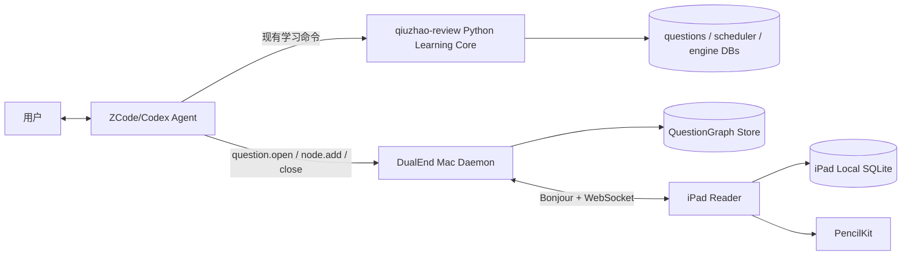
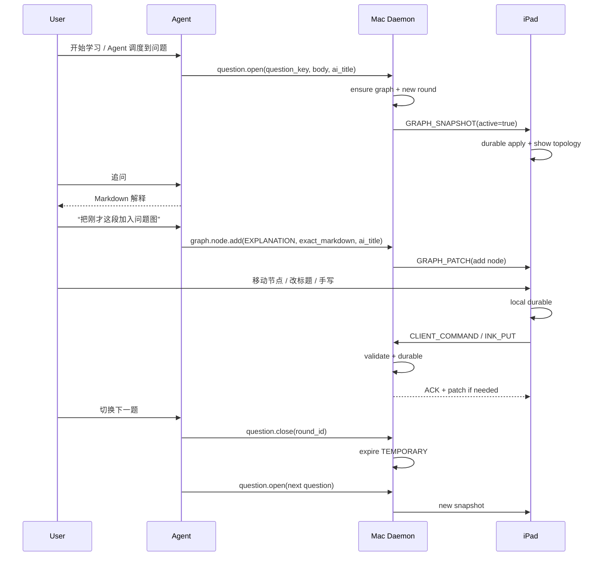

# 总体架构

## 1. 逻辑组件

## 2. 权威边界

### 现有学习领域

权威仍属于原有 Python + SQLite：题库、Goal、调度、学习事件、review capsule。

### 新双端领域

Mac `QuestionGraph Store` 是以下数据的 canonical merge point：

- graph identity；
- node existence/tombstone；
- node immutable body；
- title；
- graph layout；
- round lifecycle；
- iPad Ink 备份；
- sync journal。

iPad 本地库是交互侧 durable cache / outbox，不取代 Mac canonical authority。

## 3. 主流程

## 4. 为什么不让 Daemon 监听聊天窗口

ZCode/Codex 等 Agent 宿主没有统一可靠的外部 transcript hook。抓窗口/日志会造成宿主耦合和隐私风险。当前 Agent 已经执行 Runtime Prompt，因此最可靠的集成点是**Agent 显式调用稳定 CLI/localhost API**。
