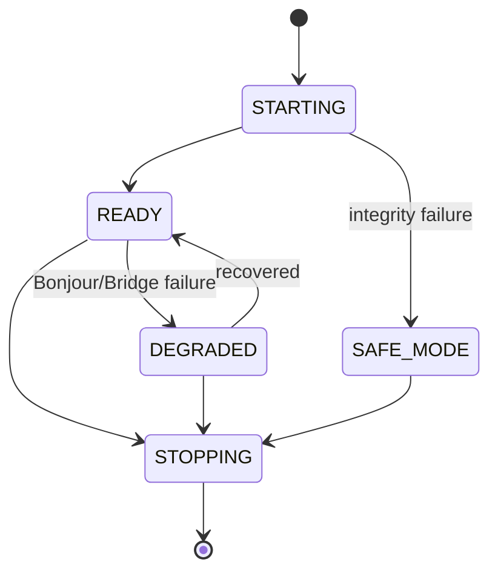

# 状态机

## 1. Daemon



## 2. Question Round

```text
ACTIVE -> CLOSED
ACTIVE -> INTERRUPTED   # crash/reopen/new question fallback
```

只有 ACTIVE round 能新增 TEMPORARY。

## 3. iPad Connection

```text
CACHED_OFFLINE
 -> DISCOVERING
 -> CONNECTING
 -> SYNCING
 -> READY
 -> CACHED_OFFLINE (disconnect)
```

UI 在所有状态都可读 cache（首次从未同步除外）。

## 4. Outbox

```text
PENDING -> INFLIGHT -> ACKED(delete row)
            | disconnect
            v
          PENDING
```

没有“send succeeded = done”。

## 5. Node

```text
VISIBLE -> TOMBSTONED
TEMPORARY(VISIBLE,current round) -> EXPIRED(round close)
```

无 resurrection 命令 v1。
